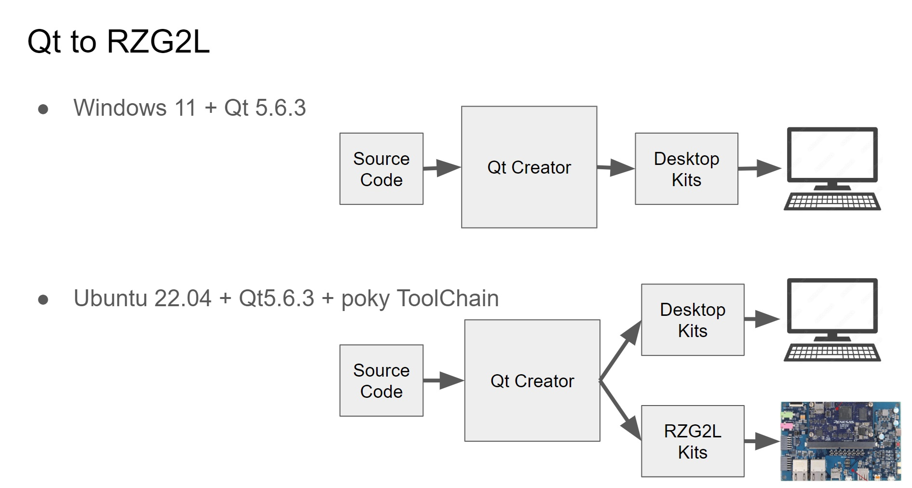

# q563_coffee

Example Qt5.6.3 project for running on RZ/G2L

**Reference** : 

https://doc.qt.io/qt-5/qml-qtquick-controls2-stackview.html

## 1. Qt installation 

Download Qt 5.6.3 at

https://download.qt.io/new_archive/qt/5.6/5.6.3/

- For Windows 11, select

qt-opensource-windows-x86-mingw492-5.6.3.exe

- For Ubuntu 22.04, select

qt-opensource-linux-x64-5.6.3.run

For building the final executable running on RZ/G2L, please use Linux version.

Windows version Qt can be used for early stage UI development ( build and run the project with desktop kits ), since Windows environment is more convenient for some people.

After the Qt5.6.3 installation, please install tool chain on Qt( for Linux version only).

If you installed multiple versions of Qt creator, before the running of another version, please make a copy of the old QtProject folder under:

- Windows : under %appdata% folder

- Ubuntu : under ~/.config folder

## 2. Development flow 

For Windows version, we only need to build and run desktop version to make sure everything goes well. 

For Linux version, we can build and run desktop version for most of the time. Then switch to RZ/G2L kits, then build and run the executable on RZG2L.

Please use this repo as a Qt test project, to verify that your environment has been set up successfully. 

Run Qt creator, File/open file or project then browse to  q563_coffee.pro, 

Ctrl-B to build project, Ctrl-R to run on desktop for test. 

Click on Projects on the left side, add kits for RZ/G2L, Ctrl-B to build,

browse to the RZ/G2L build output folder,  copy the executable named q563_coffee to somewhere like ~ for transfering to RZG2L later.

Finally, go to your RZ/G2L target board,

scp q563_coffee root@ip_of_rzg2l:/home/root 

boot your RZ/G2L and run 

cd /home/root
./q563_coffee

Another coffee machine example originally come from Qt5.12.10 Examples as below,

moil_coffee:

https://github.com/yourskc/moil_coffee

 

## 3. QtQuick version

Since we focus on smart devices and home appliance development, Qt Quick is more suitable than Qt Widgets. 

To create a new project, choose Applications/Qt Quick Controls Application.

To create a new single QML File, choose Qr/QML File(Qt Quick 2)

In the .qml file, we need to specify the version of QtQuick Controls, the followings list the version information. 

import QtQuick 2.5

import QtQuick.Window 2.0

import QtQuick.Controls 1.4

import QtQuick.Dialogs 1.2

import QtQuick.Controls.Styles 1.4

import QtQuick.Layouts 1.2

